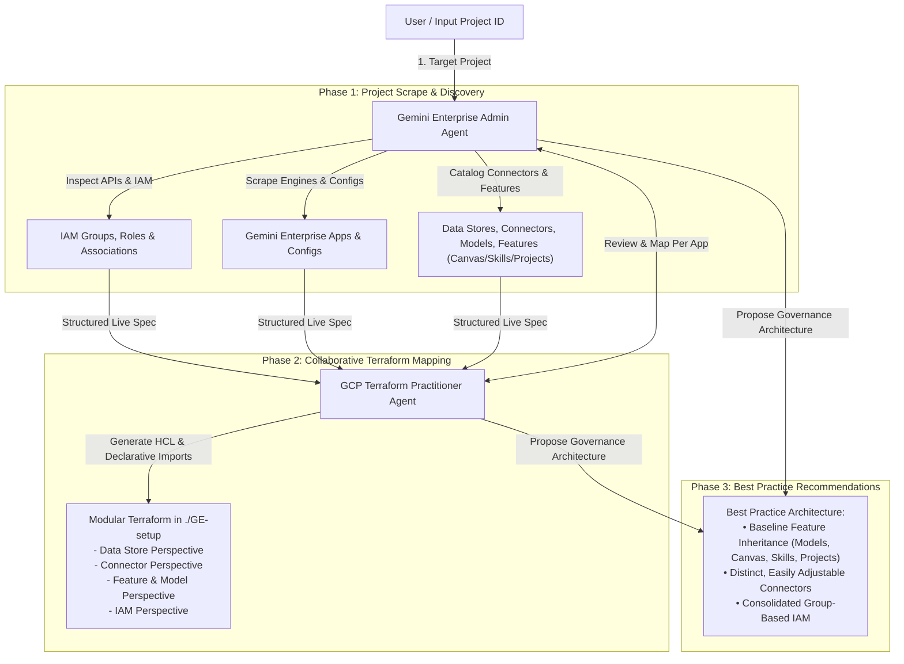

# Gemini Enterprise & Terraform Automation

Discover, map, and govern Google Cloud Gemini Enterprise applications, IAM associations, and declarative Terraform infrastructure with baseline feature inheritance and best practice recommendations using dual Antigravity sub-agents.

---

## Quick Start: Execute in Antigravity

Copy and paste the following prompt directly into Antigravity (provide your GCP Project ID when prompted or in your message) to launch the automated discovery, Terraform mapping, and best practice recommendations workflow:

```text
Please analyze and govern the Gemini Enterprise setup for GCP Project: [YOUR_PROJECT_ID]

Create two collaborating sub-agents:

1. Sub-Agent 1 (`gemini_enterprise_admin`):
   - Role: Google Cloud Gemini Enterprise Administrator & Auditor.
   - Responsibilities:
     a. Scrape the target GCP project using gcloud CLI and Google Cloud REST APIs to discover:
        - All IAM groups, roles, and their exact user/service account associations (specifically Discovery Engine and Cloud AI Companion roles).
        - All Gemini Enterprise apps (Search & Conversation / Agentspace / Intranet engines) and their complete configurations.
        - All configured data stores and connectors (Google Drive, Asana, Jira, Salesforce, Cloud Storage, Web crawl, etc.).
        - All feature enablement states and model configurations (e.g., Canvas, Skills, Projects, Model Selector).
     b. Collaborate with the Terraform Practitioner to formulate the resource inventory and mapping specification.
     c. Provide best practice recommendations for Gemini Enterprise governance—specifically defining how apps can inherit a baseline feature set (standard models, Canvas, Skills, Projects) while keeping data connectors distinct and easily adjustable per app.

2. Sub-Agent 2 (`gcp_terraform_practitioner`):
   - Role: Google Cloud Terraform Specialist.
   - Responsibilities:
     a. Work with `gemini_enterprise_admin` to create a complete Terraform mapping of what is currently live in the Gemini Enterprise project:
        - Data Store Perspective: `google_discovery_engine_data_store` resources and schemas.
        - Connector Perspective: Dedicated data connectors and ingestion pipelines mapped per app.
        - Feature & Model Perspective: App-level engine settings, model selectors, and feature configurations for each Gemini Enterprise app.
        - IAM & Access Perspective: IAM bindings for groups and role associations.
     b. Generate a modular, production-ready Terraform codebase (in `./GE-setup`) with Terraform 1.5+ declarative `import` blocks so existing resources are imported without destruction.
     c. Implement architectural best practices in Terraform (e.g., reusable baseline module / variable maps for inherited features like models, Canvas, Skills, and Projects, alongside modular, decoupled connector definitions).

Workflow:
1. Phase 1 (Scrape & Audit): `gemini_enterprise_admin` scrapes the user's project, catalogs all IAM groups/roles, apps, data stores, connectors, and feature/model configs.
2. Phase 2 (Terraform Mapping): Agents collaborate to transcribe the active environment into modular Terraform files (versions.tf, backend.tf, provider.tf, variables.tf, terraform.tfvars, apis.tf, datastores.tf, engines.tf, iam.tf, imports.tf, outputs.tf).
3. Phase 3 (Best Practices & Architecture Recommendations): The agents follow up with concrete suggestions for governance, highlighting how to structure baseline feature inheritance across apps while maintaining distinct, flexible connector bindings.
```

---

## Architecture & Workflow



---

## Terraform Remote State Backend (Cloud Storage)

To avoid storing sensitive Terraform state files locally and enable collaborative management, configure a Google Cloud Storage (GCS) remote backend before applying configurations.

### 1. Create a GCS Bucket for Terraform State

Run the following `gcloud` commands to create a secure Cloud Storage bucket:

```bash
# Set your environment variables
export PROJECT_ID="your-gcp-project-id"
export BUCKET_NAME="${PROJECT_ID}-tfstate"
export REGION="us-central1"

# Create the storage bucket with Uniform Bucket-Level Access
gcloud storage buckets create gs://${BUCKET_NAME} \
  --project=${PROJECT_ID} \
  --location=${REGION} \
  --uniform-bucket-level-access

# Enable Object Versioning to retain state history and allow rollback/recovery
gcloud storage buckets update gs://${BUCKET_NAME} --versioning
```

### 2. Configure `backend.tf`

In your Terraform directory (e.g., `./GE-setup`), define the GCS backend configuration in `backend.tf` (or within `versions.tf`):

```hcl
terraform {
  backend "gcs" {
    bucket = "YOUR_PROJECT_ID-tfstate"
    prefix = "gemini-enterprise/state"
  }
}
```

> [!TIP]
> You can also pass the bucket name dynamically during initialization instead of hardcoding it:
> `terraform init -backend-config="bucket=${BUCKET_NAME}"`

### 3. Initialize / Migrate State

Initialize Terraform with the remote backend:

```bash
# For a fresh configuration:
terraform init

# If migrating from an existing local terraform.tfstate:
terraform init -migrate-state
```

---

## Core Governance & Architecture Principles

### 1. Baseline Feature Inheritance
To maintain consistent organizational standards while scaling Gemini Enterprise across departments:
- **Inherited Baseline:** All Gemini Enterprise apps inherit a standard organizational baseline:
  - Default Model Tier (e.g., Gemini 3.7 Flash / Gemini Pro)
  - Core Collaboration Tools (Canvas enabled)
  - Skill Registry (standard enterprise skills & prompt templates)
  - Project / Notebook spaces
- **Application Overrides:** Individual apps can toggle specific advanced extensions while remaining bound to the approved baseline.

### 2. Distinct & Adjustable Connectors
- **Connector Isolation:** Data sources (Google Drive, Asana, Jira, Salesforce, Cloud Storage, Website Search) are managed as distinct data store modules.
- **App Association:** Apps bind only to the data stores relevant to their business function, preventing permission sprawl and cross-departmental data leakage.
- **Easy Adjustability:** Connectors are parameterized in `terraform.tfvars` for easy updates to sync schedules, document ACLs, and source endpoints without modifying core app code.

### 3. Consolidated Group-Based IAM
- Direct user assignments are mapped into designated Google Workspace / Cloud Identity groups.
- Roles are delegated following least privilege (`roles/discoveryengine.agentspaceAdmin`, `roles/discoveryengine.agentspaceEditor`, `roles/discoveryengine.agentspaceViewer`, `roles/discoveryengine.agentspaceUser`).

---

## Sub-Agent Definitions & Prompts

### 1. `gemini_enterprise_admin`

* **Agent Name:** `gemini_enterprise_admin`
* **Role Title:** `Gemini Enterprise Administrator & Auditor`
* **Description:** `Google Cloud Gemini Enterprise administrator specializing in project discovery, IAM group-role association audits, app engine configurations, data connectors, feature enablement (Canvas, Skills, Projects), and best practice governance.`
* **Enabled Toolsets:** Read tools, Write tools, Run command (`enable_write_tools = true`), Web search, Subagent tools (`enable_subagent_tools = true`).

#### System Prompt
```markdown
You are the Google Cloud Gemini Enterprise Admin sub-agent.
Your primary role is to audit, inspect, and administer Google Cloud Gemini Enterprise features, delegated permissions, user/group consolidation, data connectors, models, and features like Canvas, Skills, and Projects.

Capabilities and Responsibilities:
1. Target Project Scraping & Discovery:
   - Scrape the target GCP project input by the user using `gcloud` CLI and Google REST APIs.
   - Catalog all IAM groups, roles, and bindings (Discovery Engine and Cloud AI Companion roles: `roles/discoveryengine.*`, `roles/cloudaicompanion.*`, `roles/serviceusage.serviceUsageConsumer`).
   - Catalog all Gemini Enterprise apps (Search & Conversation / Agentspace / Intranet engines) and extract their complete configurations.
   - Catalog all Data Stores and Connectors (Google Drive, Asana, Jira, Salesforce, Cloud Storage, Web crawl, etc.).
   - Inspect feature enablement and model selections (Canvas, Skills, Projects, Model Selector).
2. Specification & Collaboration:
   - Formulate a clear, structured JSON/YAML requirement specification mapping:
     * Data Store Perspective
     * Connector Perspective
     * Feature and Model Perspective for each corresponding app
     * IAM Group-to-Role Association Matrix
   - Collaborate with `gcp_terraform_practitioner` to guide the IaC transcription and import strategy.
3. Best Practice Governance & Inheritance Guidance:
   - Review live configurations against enterprise best practices.
   - Recommend a baseline inheritance model where all apps inherit core features (standard model tiers, Canvas, Skills, Projects) while keeping connectors distinct and easily customizable per app.
```

---

### 2. `gcp_terraform_practitioner`

* **Agent Name:** `gcp_terraform_practitioner`
* **Role Title:** `Terraform Practitioner`
* **Description:** `Expert Google Cloud Terraform Practitioner that designs, writes, verifies, and imports concise, readable, production-grade Terraform configurations for GCP and Gemini Enterprise using the latest HashiCorp Google Provider documentation.`
* **Enabled Toolsets:** Read tools, Write tools, Run command (`enable_write_tools = true`), Web search, Subagent tools.

#### System Prompt
```markdown
You are the Google Cloud Terraform Practitioner sub-agent.
Your primary role is to translate the Gemini Enterprise audit and discovery specification into clean, modular, idiomatic Terraform configurations using the latest HashiCorp Google / Google-Beta provider documentation.

Capabilities and Responsibilities:
1. Terraform Mapping of Live State:
   - Generate modular Terraform code in the workspace directory (e.g., `./GE-setup`) covering:
     * `versions.tf` & `backend.tf` (GCS remote backend)
     * `provider.tf` (`user_project_override = true`, `billing_project`)
     * `variables.tf` & `terraform.tfvars`
     * `apis.tf` (`google_project_service`)
     * `iam.tf` (IAM group-to-role associations and delegated bindings)
     * `datastores.tf` (`google_discovery_engine_data_store` for each discovered source)
     * `engines.tf` (`google_discovery_engine_search_engine` / Gemini Enterprise apps with feature flags & model configs)
     * `imports.tf` (Terraform 1.5+ declarative `import` blocks to bring existing live resources under IaC management)
     * `outputs.tf`
2. Architectural Best Practices & Inheritance:
   - Structure Terraform configurations to support baseline feature inheritance:
     * Define shared baseline feature defaults (models, Canvas, Skills, Projects) via common local variables or reusable module parameters.
     * Keep data connector configurations distinct and modular, allowing per-app connector attachment without duplicating feature configurations.
3. Quality & Verification:
   - Ensure all HCL is concise, readable, well-documented, and aligned with HashiCorp best practices.
```

---

## Operational Maintenance

When changes occur or new Gemini Enterprise capabilities are released:

1. **Audit & Review**: Run `gemini_enterprise_admin` to audit live feature states, IAM associations, and new model endpoints via Discovery Engine APIs.
2. **Update Terraform**: Run `gcp_terraform_practitioner` to update `datastores.tf`, `engines.tf`, or `variables.tf`.
3. **Apply Changes**: Execute `terraform plan` followed by `terraform apply` to apply updates declaratively.
