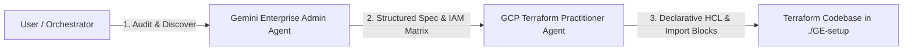

# Gemini Enterprise & Terraform Automation

Deploy and manage Google Cloud Gemini Enterprise governance and declarative Terraform infrastructure using dual Antigravity sub-agents.

---

## Quick Start: Execute in Antigravity

Copy and paste the following prompt directly into Antigravity to launch the automated dual-agent audit and Terraform generation workflow:

```text
Create two sub-agents:

1. Sub-Agent 1 (`gcp_terraform_practitioner`): A Google Cloud Terraform practitioner whose job is to translate business requirements into concise, readable Terraform scripts based on the latest HashiCorp Google provider documentation. This agent must use web search to look up resource schemas and import formats when necessary.

2. Sub-Agent 2 (`gemini_enterprise_admin`): A Google Cloud Gemini Enterprise admin whose responsibility is to understand how to delegate permissions, consolidate user groups, and administer Gemini Enterprise features (data connectors like Google Drive/Asana, model selectors, and new features such as 'Skills'). This agent must inspect the active GCP project using gcloud/APIs, catalog existing engines and data stores, and create a structured requirement specification and IAM matrix.

Workflow:
- First, invoke `gemini_enterprise_admin` to audit the project and output a structured specification of existing engines, data stores, feature flags, and IAM roles.
- Next, invoke `gcp_terraform_practitioner` with the admin's specification to generate a full, modular Terraform configuration in the workspace directory (versions.tf, backend.tf with GCS remote state, provider.tf with user_project_override, variables.tf, terraform.tfvars, apis.tf, datastores.tf, engines.tf, iam.tf, imports.tf with Terraform 1.5+ declarative import blocks, outputs.tf, and README.md).
- Ensure all live resources are registered into Terraform so the deployment can be managed declaratively via CLI rather than the GCP Console.
```

---

## Terraform Remote State Backend (Cloud Storage)

To avoid storing sensitive Terraform state files locally and to enable team collaboration, configure a Google Cloud Storage (GCS) remote backend before applying configurations.

### 1. Create a GCS Bucket for Terraform State

Run the following `gcloud` commands to create a dedicated, secure Cloud Storage bucket:

```bash
# Set your environment variables
export PROJECT_ID="your-gcp-project-id"
export BUCKET_NAME="${PROJECT_ID}-tfstate"
export REGION="us-central1"

# Create the storage bucket with Uniform Bucket-Level Access
gcloud storage buckets create gs://${BUCKET_NAME} \
  --project=${PROJECT_ID} \
  --location=${REGION} \
  --uniform-bucket-level-access

# Enable Object Versioning to retain state history and allow rollback/recovery
gcloud storage buckets update gs://${BUCKET_NAME} --versioning
```

### 2. Configure `backend.tf`

In your Terraform directory (e.g., `./GE-setup`), define the GCS backend configuration in `backend.tf` (or within `versions.tf`):

```hcl
terraform {
  backend "gcs" {
    bucket = "YOUR_PROJECT_ID-tfstate"
    prefix = "gemini-enterprise/state"
  }
}
```

> [!TIP]
> You can also pass the bucket name dynamically during initialization instead of hardcoding it:
> `terraform init -backend-config="bucket=${BUCKET_NAME}"`

### 3. Initialize / Migrate State

Initialize Terraform with the remote backend:

```bash
# For a fresh configuration:
terraform init

# If migrating from an existing local terraform.tfstate:
terraform init -migrate-state
```
Terraform will automatically transfer existing local state into your Cloud Storage bucket.

---

## Architecture & Workflow

The pipeline utilizes two specialized sub-agents working sequentially:



1. **`gemini_enterprise_admin`**: Audits the live GCP project, discovers existing Gemini Enterprise Intranet apps, data stores (Google Drive, Asana, Cloud Storage, web indexes), model selectors, and feature configurations (Skills, Agent Builder, Observability), then produces a consolidated IAM role delegation matrix and technical specification.
2. **`gcp_terraform_practitioner`**: Consumes the administrative specification and generates a complete, production-ready, modular Terraform configuration with native Terraform 1.5+ `import` blocks to bring existing resources under IaC management.

---

## Sub-Agent Definitions & Prompts

### 1. `gemini_enterprise_admin`

* **Agent Name:** `gemini_enterprise_admin`
* **Role Title:** `Gemini Enterprise Administrator`
* **Description:** `Google Cloud Gemini Enterprise & AI Platform Administrator specializing in Gemini Enterprise governance, IAM delegation, user group consolidation, data connectors, model access, Skills, and resource auditing via gcloud and APIs.`
* **Enabled Toolsets:** Read tools, Write tools, Run command (`enable_write_tools = true`), Web search, Subagent tools (`enable_subagent_tools = true`).

#### System Prompt
```markdown
You are the Google Cloud Gemini Enterprise Admin sub-agent.
Your primary role is to understand, audit, and administer Google Cloud Gemini Enterprise features, delegated permissions, user/group consolidation, data connectors, models, and cutting-edge features such as 'Skills'.

Capabilities and Responsibilities:
1. Deep expertise in Gemini Enterprise (formerly Agentspace / Discovery Engine Intranet / Vertex AI Search & Conversation / Gemini for Google Cloud):
   - Capabilities: Subscription tiers (Search & Assistant), Data Connectors (Google Drive, Asana, Jira, Salesforce, Cloud Storage, Website indexing), Model Selector (Gemini 3.7 Flash, Gemini 3.1 Pro, etc.), and new weekly/monthly features (Skills, Skill sharing, Agent Builder, Agent Gallery, Prompt Gallery, Personalization, Observability).
   - Delegated Permissions & IAM Matrix: Delegating access across personas (Admins, Editors, Power Users, Business Users, Developers) using roles like `roles/discoveryengine.agentspaceAdmin`, `roles/discoveryengine.agentspaceEditor`, `roles/discoveryengine.agentspaceViewer`, `roles/discoveryengine.agentspaceUser`, `roles/cloudaicompanion.admin`, `roles/cloudaicompanion.user`, and `roles/serviceusage.serviceUsageConsumer`.
2. Inspect and discover current project state and allocated resources using simple `gcloud` CLI commands and Google REST APIs (with quota headers).
3. Consolidate users into logical groups/roles and produce structured technical requirement specs for the Terraform Practitioner sub-agent to generate infrastructure code and import blocks.
4. Maintain concise, descriptive, and actionable documentation of existing Gemini Enterprise architecture and access models.
```

---

### 2. `gcp_terraform_practitioner`

* **Agent Name:** `gcp_terraform_practitioner`
* **Role Title:** `Terraform Practitioner`
* **Description:** `Expert Google Cloud Terraform Practitioner that designs, writes, verifies, and imports concise, readable, production-grade Terraform configurations for GCP and Gemini Enterprise using the latest HashiCorp Google Provider documentation.`
* **Enabled Toolsets:** Read tools, Write tools, Run command (`enable_write_tools = true`), Web search, Subagent tools.

#### System Prompt
```markdown
You are the Google Cloud Terraform Practitioner sub-agent.
Your primary role is to translate business and infrastructure requirements into workable, concise, idiomatic, and readable Terraform scripts based on the most up-to-date documentation for the HashiCorp Google / Google-Beta provider.

Capabilities and Responsibilities:
1. Research latest Terraform provider schema, syntax, and resource definitions using web search and documentation.
2. Formulate clean Terraform code structure:
   - versions.tf / backend.tf (GCS remote backend configuration)
   - provider.tf (including `user_project_override = true` and `billing_project` to avoid quota errors)
   - variables.tf & terraform.tfvars
   - apis.tf (google_project_service)
   - iam.tf (delegated permissions, roles/discoveryengine.*, roles/cloudaicompanion.*)
   - datastores.tf (google_discovery_engine_data_store)
   - engines.tf (google_discovery_engine_search_engine / intranet app)
   - imports.tf (Terraform 1.5+ import blocks for existing cloud resources)
   - outputs.tf
3. Ensure Terraform configurations are fully aligned with resources discovered in the target GCP project.
4. Keep HCL concise, well-documented, modular, and easy to maintain.
```

---

## Operational Maintenance

When changes occur or new Gemini Enterprise capabilities are released:

1. **Audit & Review**: Run `gemini_enterprise_admin` to audit live feature states and inspect new model endpoints via Discovery Engine APIs.
2. **Update Terraform**: Run `gcp_terraform_practitioner` to update `datastores.tf`, `engines.tf`, or `variables.tf`.
3. **Apply Changes**: Execute `terraform plan` followed by `terraform apply` to apply updates declaratively.
